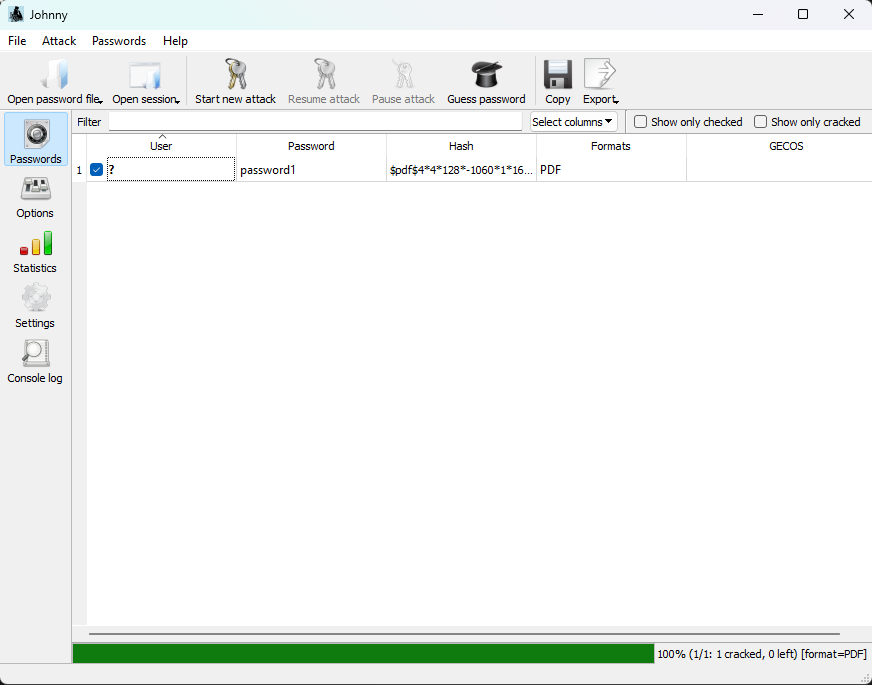
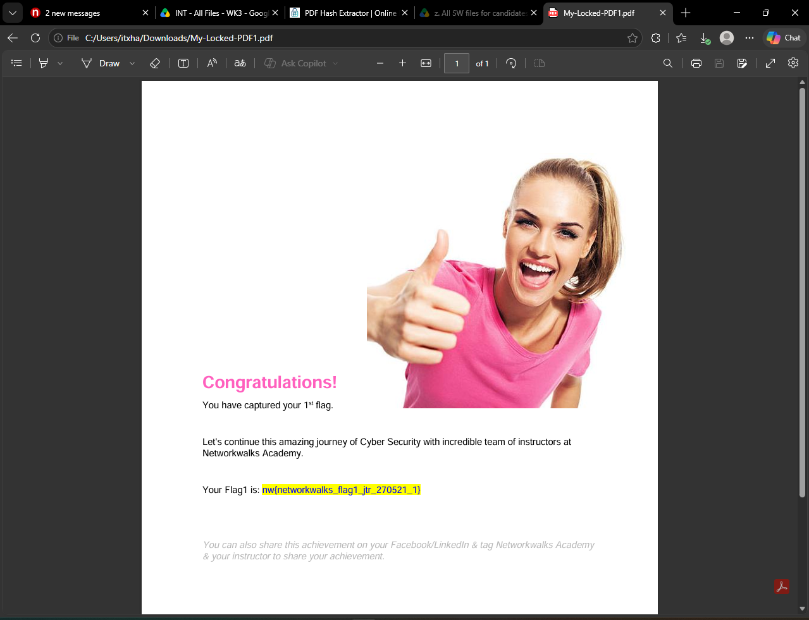

# W3-P1 — Week 3 Report: Cracking File Passwords with John the Ripper & Johnny GUI

> **Program:** Cybersecurity & Ethical Hacking Internship — Networkwalks
> **Week:** 03
> **Author:** Ahmad Hassan | Cybersecurity Professional (B083)
> **LinkedIn:** [https://www.linkedin.com/in/itxhassan](https://www.linkedin.com/in/itxhassan)
> **Repository:** GitHub

---

## 1. Liability Disclaimer

I have performed these activities only on the systems & devices where I had secured written permission or the devices/systems that I own myself. All these materials are for education and research purpose only. Do not use anything from here to break the law. The instructor, the authors and Networkwalks are not responsible for what you do with this knowledge. Every action you take is your own responsibility. Misuse can lead to criminal charges, heavy fines, loss of your job and a permanent record. In most countries unauthorised access is a crime even when nothing is damaged.

---

## 2. Introduction

This report covers the use of **John the Ripper (JtR)** and its graphical front-end **Johnny** to crack the password of a locked PDF file. Building on Week 2, where I learned footprinting and network scanning, Week 3 moves into the **password cracking / offline attack** phase of ethical hacking.

The workflow included downloading and installing Johnny, linking it to the John the Ripper binary (`john.exe`), extracting the hash from a locked file using an online hash extraction tool, and finally running a dictionary/wordlist-based attack inside Johnny to recover the password.

All commands and steps were executed in a controlled lab environment for educational purposes only.

---

## 3. Tools Used

| Tool | Purpose |
|---|---|
| Johnny GUI (`jonnyinstaller.exe`) | Graphical front-end for John the Ripper |
| John the Ripper (`john.exe`) | Password cracking engine (back-end) |
| Online Hash Crack | Extract hash from a locked PDF file |
| Windows CMD / Notepad | Create and store the hash in a `.txt` file |
| Locked PDF File | Target file used for the exercise |

Download links:
- Johnny GUI(official website) — https://openwall.info/wiki/john/johnny
- John the Ripper(official website) — https://www.openwall.com/john/
- Both files in one place — [Google Drive Folder](https://drive.google.com/drive/u/1/folders/1aHtgOh7U9mQhkN8VHU7ctTyaDg5KbuJx)
- Hash Extractor — https://www.onlinehashcrack.com/tools-pdf-hash-extractor.php

---

## 4. Activities Performed

### Step 1 — Download & Install Johnny GUI

I downloaded the `jonnyinstaller.exe` file from the official Openwall wiki and installed **Johnny** on my Windows PC.

---

### Step 2 — Download John the Ripper

I downloaded **John the Ripper** from the official Openwall website and extracted the archive on my PC.

---

### Step 3 — Link `john.exe` inside Johnny

I opened **Johnny** and went to the **Settings** tab. Under the **John** section, I browsed and selected the path to `john.exe` so that Johnny could use John the Ripper as its cracking engine.

---

### Step 4 — Extract the Hash from the Locked File

I downloaded a **password-protected file** (target) and generated its **hash** using the online tool:

The extracted hash looked similar to:

```
$pdf$2*3*128*-3904*1*16*...*...*...
```

---

### Step 5 — Save the Hash into a `.txt` File

I created a new text file on my PC (e.g., `hash.txt`) and pasted the extracted hash into it.

---

### Step 6 — Load the Hash File into Johnny

Inside Johnny, I clicked:

**Open password file → Open PASSWD file (Password format)**

…and browsed to my saved `hash.txt` file.

---

### Step 7 — Start the Attack

I clicked **Start new Attack** and let Johnny run John the Ripper against the hash. Within **seconds**, the password was recovered and displayed in the **Passwords** tab.

> 📸 
> *Figure 8: The recovered password displayed in the Passwords tab.*

---

### Step 8 — Open the File with the Recovered Password

Using the cracked password, I successfully opened the locked file.

> 📸 
> *Figure 9: The locked file opened successfully using the recovered password.*

---

## 5. Observations / Risk Analysis

| # | Observation | Potential Impact | Risk Level |
|---|---|---|---|
| 1 | Weak passwords are cracked within seconds using dictionary attacks. | Attackers can gain unauthorized access to files. | 🔴 Critical |
| 2 | Offline hash attacks require no interaction with the target. | Hard to detect — no logs on the victim side. | 🟠 Medium |
| 3 | PDF password protection alone is not enough. | Files may be opened if the hash leaks. | 🟠 Medium |
| 4 | Reused or simple passwords fall quickly. | Credential stuffing / lateral movement. | 🔴 Critical |

**Risk level key:** 🔴 Critical · 🟠 Medium · 🟢 Low

These observations demonstrate **why strong, unique, high-entropy passwords** (or passphrases) are essential — especially for files and archives that can be copied and attacked offline.

---

## 6. Recommendations

1. **Use strong passphrases** (12+ characters, mixed case, symbols, numbers).
2. **Never reuse passwords** across files, accounts, or systems.
3. **Enable full-disk encryption** (BitLocker, VeraCrypt) in addition to file passwords.
4. **Use a password manager** to generate and store strong credentials.
5. **Avoid sharing password-protected files over insecure channels** — use end-to-end encrypted transfers.
6. **Rotate passwords** for sensitive files periodically.
7. **Hash-extraction is trivial** — assume a leaked file will be attacked. Plan defenses accordingly.
8. **Enable Multi-Factor Authentication (MFA)** for cloud/shared storage containing sensitive data.
9. **Perform password audits** using tools like John the Ripper against your own accounts (with authorization) to find weak credentials before attackers do.

---

## 7. Conclusion

During **Week 3** of my Cybersecurity & Ethical Hacking internship, I learned how to:

- Install and configure **Johnny GUI** as a front-end for **John the Ripper**.
- Extract a **hash** from a locked file using an online hash extractor.
- Save the hash into a text file and load it into Johnny.
- Launch a **password cracking attack** and recover the original password within seconds.

This exercise reinforced an important lesson: **password strength is a critical line of defense.** Even files that appear protected by a password can be cracked quickly if the password is weak. Understanding how attackers work helps defenders build stronger systems.

All activities were performed **within an authorized educational lab** on my own files.

---

**— End —**

---

## Project Information

| Field | Value |
|---|---|
| **Author** | Ahmad Hassan \| Cybersecurity Professional (B083) |
| **LinkedIn** | [https://www.linkedin.com/in/itxhassan](https://www.linkedin.com/in/itxhassan) |
| **Program Name** | Cybersecurity program at Networkwalks |
| **Week** | 03 |
| **Repository** | GitHub |
